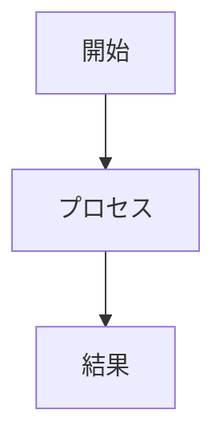

# ブログ執筆ガイドライン
 
このドキュメントでは、ポートフォリオサイトのブログ記事を作成・管理するためのルールを定義します。
 
**最終更新**: 2026-01-16 (画像キャプション機能追加)

## 1. ファイルとディレクトリ構造

- **保存場所**: `content/blog/`
- **ファイル名**: `NNN-kebab-cased-title.md` (例: `051-growth-mindset.md`)
  - `NNN`: 3桁の連番
  - `kebab-cased-title`: 英語の簡潔なスラッグ（URLの一部になりますが、実際のURLはFrontmatterのslugが優先されます）

## 2. Frontmatter (必須)

すべてのMarkdownファイルは、以下のFrontmatterで開始する必要があります。

```yaml
---
title: "記事のタイトル"
description: "記事の概要（100文字程度）"
date: "YYYY-MM-DD"
category: "カテゴリ名（日本語）"
tags: ["タグ1", "タグ2"]
slug: "kebab-cased-url-slug"
published: true
---
```

### フィールド詳細

| フィールド | 必須 | 説明 | ルール |
|------------|------|------|--------|
| `title` | ✅ | 記事のタイトル | 30文字以内で魅力的に |
| `description`| ✅ | 概要 | SEO用のメタディスクリプション。記事の本質を100文字前後で要約。 |
| `date` | ✅ | 公開日 | `YYYY-MM-DD` 形式。<br>**重要**: 未来の日付を設定すると、その日までサイト上には表示されません（予約投稿）。 |
| `category` | ✅ | カテゴリ | 原則**日本語**を使用（例: "思考法", "キャリア", "生産性"）。 |
| `tags` | ✅ | タグ | 配列形式。原則**日本語**を使用。3〜5個が適切。 |
| `slug` | ✅ | URLスラッグ | URLの一部になります (`/blog/slug`)。半角英数字とハイフンのみ。 |
| `published` | ❌ | 公開フラグ | `false` にすると下書き状態になります。省略時は `true` 扱い。 |

### SEOのベストプラクティス

- **タイトル**: 検索クエリを意識しつつ、読み手の興味を引く言葉選び
- **ディスクリプション**: 記事の価値を端的に伝え、クリックを促す
- **タグ**: 関連性の高い言葉を含める（重複を避ける）

## 3. カテゴリ・タグの運用

サイトの一貫性を保つため、カテゴリとタグは**日本語**で統一します。

### 推奨カテゴリ

- マインドセット
- 生産性
- キャリア
- 思考法
- コーチング
- AI活用
- メンタルモデル
- 自己認識
- 行動科学

### タグ付けのルール

- 原則として既存のタグを優先して使用
- 新しいタグを作成する場合は、類似するタグと重複しないよう注意
- 同義語の乱立を避ける（例: 「コーチング」「セッション」のどちらかに統一）
- 具体的すぎるタグ（例: 「ノウハウ依存からの卒業」）は避ける

## 4. 記事の構造パターン

読みやすさを最大化するため、以下の標準構造に従ってください。

### 推奨される記事構造

```markdown
---
title: "記事タイトル"
description: "概要"
date: "YYYY-MM-DD"
category: "カテゴリ"
tags: ["タグ1", "タグ2"]
slug: "url-slug"
published: true
---

## はじめに

読者の関心を惹く短い導入（2〜3段落）。問題提起や問いかけから入ると効果的。

---

## セクション1

主な内容の最初のパート。

### サブセクション1-1

詳細な説明。

---

## セクション2

内容を展開するパート。

### サブセクション2-1

さらに深掘りする内容。

---

## 実践できること / セッションでできること

読者が今日から実践できる具体的なアクション、またはセッションで提供される価値を明確に。

---

## まとめ

記事全体を振り返り、主要なポイントを再確認。

---

## CTA（コール・トゥ・アクション）

読者への次のステップを促す（セッションへの誘導など）。
```

### 構造の原則

1. **H2セクション間の区切り**: `---` を使用して視覚的に明確に区切る
2. **H3の使用**: H2セクション内で補足的な情報を説明する場合に使用
3. **セクションの長さ**: 1つのH2セクションは長すぎないように（画面スクロール2〜3回分程度）
4. **フローチャート**: 複雑な概念は mermaid 図で視覚化

## 5. 本文の執筆ルール

読みやすさを重視するため、以下のガイドラインに従ってください。

### 見出し

- H1は記事タイトルとして自動生成されるため、本文は **H2 (`##`)** から始めてください。
- 階層構造を守ってください（H2 → H3 → H4）。
- **H2**: メインセクション。文末の句読点は付けない
- **H3**: サブセクション。問いかけ形式や具体的な内容を示す

### 段落と改行

- **1つの段落**: 2〜3行程度に収める（約40〜60文字）
- **段落間**: 必ず空行を入れる
- **箇条書き**: 項目を簡潔に（1行以内）
- **改行の活用**: 視覚的なリズムを作るため、意図的に改行を入れる

### タイポグラフィ（日本語最適化）

日本語の読みやすさを最大化するためのガイドライン：

| 要素 | 推奨値 | 理由 |
|------|--------|------|
| 段落あたりの文字数 | 40〜60文字 | 視線の移動がスムーズ |
| 文の長さ | 30〜50文字 | 読みやすさのスイートスポット |
| 強調の使用 | 1セクション1〜2箇所 | 過度な強調は効果を薄くする |
| 箇条書きの項目 | 短く簡潔に（15〜30文字） | スキミングを容易に |

**重要**: 長い文章は区切って、複数の短い文に分解してください。

### 画像と図表
 
#### Markdown標準の画像とキャプション
 
画像を挿入する場合、以下の構文を使用します：

```markdown

```

**重要**: キャプションはダブルクォーテーション (`"`) で囲んでください。

| 要素 | 説明 | 必須 |
|------|------|------|
| **Altテキスト** | 画像を説明する簡潔なテキスト（アクセシビリティ対応） | ✅ |
| **キャプション** | 画像の補足情報（引用元、補足説明など） | ❌ 推奨 |

**スタイリング**: 画像は自動的に拡張されたスタイリングが適用されます：
- 角丸 (12px)
- シャドウ効果
- ホバー時のスケールアニメーション
- キャプションのイタリック体
 
#### Mermaid図の使用
 
複雑な概念やプロセスは mermaid 図で視覚化してください。
 
````markdown

````
 
推奨する図のタイプ：
- `graph TD/LR`: フローチャートやプロセスの可視化
- `pie`: 比率の可視化
- `timeline`: 時系列の可視化

### コードブロック

コード例や設定例を示す場合：

````markdown
```yaml
key: value
```
````

### 引用

重要なポイントや名言を強調する場合：

```markdown
> 重要な引用や強調したいテキスト
```

### 強調

- **太字**: 最も重要なポイント（1記事あたり3〜5箇所）
- リスト形式: 項目を明確にする場合

## 6. 記事の長さと読了時間

### 目標とする記事の長さ

- **最短**: 1,200文字（約3分で読める）
- **標準**: 2,000〜3,000文字（約5〜8分で読める）
- **最長**: 4,000文字（約10分で読める）

※日本語の読書速度を400文字/分として計算

### 読了時間の計算

システムが自動的に計算しますが、目安として：
- 1,000文字 ≒ 2.5分
- 2,000文字 ≒ 5分
- 3,000文字 ≒ 7.5分

## 7. SEO対策

### キーワード戦略

- **自然な使用**: 読者を意識して、キーワードを無理なく盛り込む
- **重要な場所**: タイトル、H2見出し、最初の段落
- **関連語**: 関連する言葉も適度に使用（例: 「判断」→「決断」「選択」「意思決定」）

### 内部リンク

- 関連記事へのリンクを適度に配置
- 重要な用語の初出時にリンクを張る
- 過度なリンクは避ける

### 外部リンク

- 信頼性のある情報源を引用
- 新しいタブで開く（`target="_blank"`）

## 8. アクセシビリティ

- **Altテキスト**: すべての画像に適切なAltテキストを付ける
- **コントラスト**: テキストと背景のコントラストを確保
- **構造**: 見出しの階層を正しく使用
- **リンクテキスト**: 「ここをクリック」ではなく、リンク先の内容を示すテキストを使用

## 9. トーン＆マナー

### 推奨されるトーン

- **親しみやすい**: 読者と対話しているような感じ
- **専門的かつ分かりやすい**: 専門用語は適切に説明する
- **前向き**: 問題提起の後は解決策を示す
- **行動を促す**: 読者が実践できる具体的なアクションを提示

### 避けるべき表現

- 過度な否定表現（「〜してはいけません」の多用）
- 抽象的すぎる表現（具体例を示す）
- 一方的な主張（読者の状況に配慮する）

## 10. 品質チェックリスト

記事を公開する前に、以下のチェックリストを確認してください：

### 内容
- [ ] 記事の目的が明確か
- [ ] 読者への価値が伝わるか
- [ ] 具体例や事例が含まれているか
- [ ] 論理の飛躍がないか

### 構造
- [ ] 適切な見出しの階層があるか
- [ ] 段落が適切に分割されているか
- [ ] 箇条書きが効果的に使われているか
- [ ] 必要に応じて図表が含まれているか
- [ ] 画像にキャプションが必要か（ある場合は適切に記述されているか）

### 表記
- [ ] タイポや誤字脱字がないか
- [ ] 統一された表現を使用しているか
- [ ] 適切なトーン＆マナーか

### SEO
- [ ] 適切なキーワードが含まれているか
- [ ] タイトルとディスクリプションが魅力的か
- [ ] 関連記事へのリンクがあるか（必要な場合）

### Frontmatter
- [ ] すべての必須フィールドが入力されているか
- [ ] スラッグが正しい形式か
- [ ] タグが適切に設定されているか

## 11. 生成スクリプトの使用

記事の量産には `scripts/generate-blog-posts.ps1` を使用できますが、**生成されたファイルが本ガイドラインに準拠しているか必ず確認してください**。

### 手動で修正すべき主な項目

- 段落の長さと区切り
- 見出しの階層とセクションの区切り（`---`）
- 記事の構造パターンへの適合
- CTAセクションの追加
- キャプションの追加（画像がある場合）

## 12. 参考資料

- [ブログ読みやすさ改善プラン](../../BLOG_READABILITY_IMPROVEMENTS.md)
- [WCAG 2.2 Accessibility Guidelines](https://www.w3.org/WAI/WCAG22/Understanding/)
- [Japanese Typography Best Practices](https://www.aqworks.com/blog/perfect-japanese-typography)
